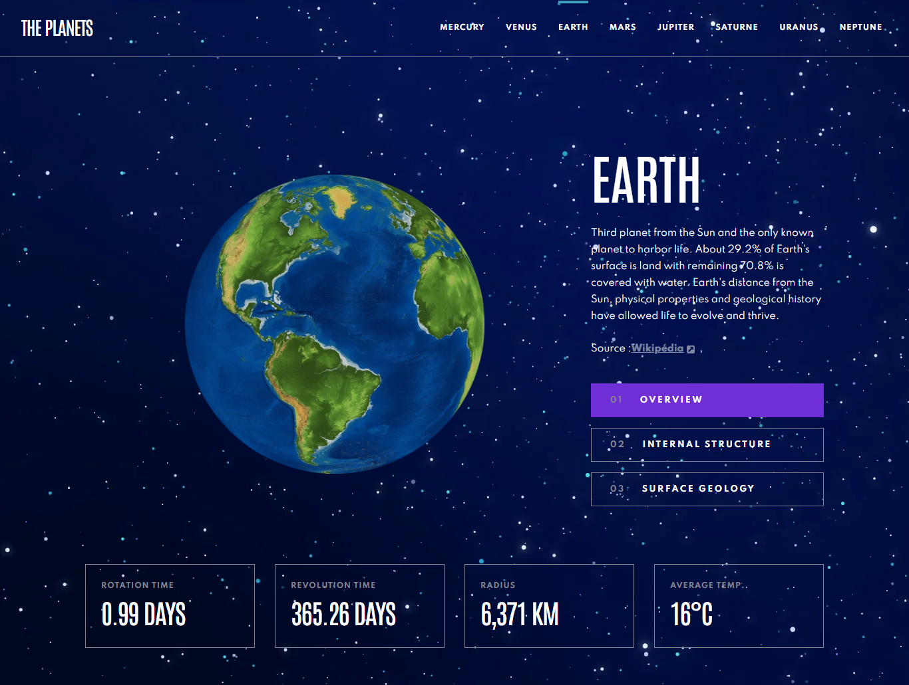
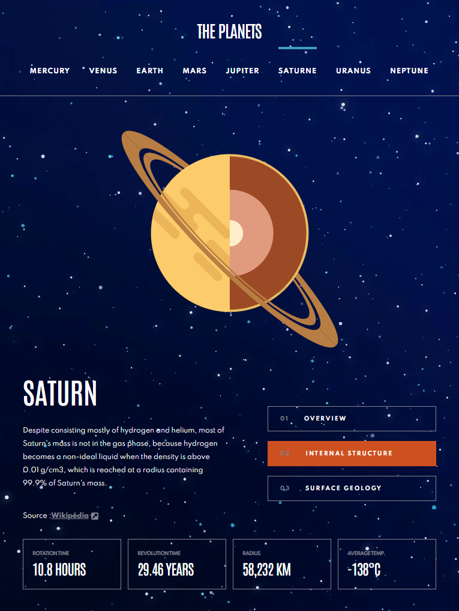

# Frontend Mentor - Planets fact site solution

Solution to the [Planets fact site challenge on Frontend Mentor](https://www.frontendmentor.io/challenges/planets-fact-site-gazqN8w_f).
I took liberties with the design and changed some images, including the background  

## Table of contents

- [Overview](#overview)
  - [The challenge](#the-challenge)
  - [Screenshots](#screenshot)
  - [Links](#links)
- [My process](#my-process)
  - [Built with](#built-with)
  - [To Do](#to-do)
  - [Project setup](#project-setup)
  - [Useful resources](#useful-resources)
  - [Credits](#credits)

## Overview

### The challenge

Users should be able to:

- View the optimal layout for the app depending on their device's screen size
- See hover states for all interactive elements on the page
- View each planet page and toggle between "Overview", "Internal Structure", and "Surface Geology"

### Screenshots

- Desktop  
  
- Tablet  
  
- Mobile  


### Links

- [Solution URL](https://www.frontendmentor.io/solutions/planets-fact-site-with-vuejs-sass-and-javascript-yo1U52F-m)  
- [Live Site URL](https://charlottesaidi.github.io/planets-fact/) 

## My process

### Built with

- [VueJs](https://vuejs.org/) - JS Framework
- Sass
- Flexbox
- JavaScript vanilla
- [Figma](https://www.figma.com/) and Font Installer

### To Do

Custom HomePage I added to the site, the challenge didn't have any... I still have to adapt it for tablet and mobile.

### Project setup
```
npm install
```

#### Compiles and hot-reloads for development
```
npm run serve
```

#### Compiles and minifies for production
```
npm run build
```

#### Lints and fixes files
```
npm run lint
```

### Useful resources

- [StackOverflow](https://stackoverflow.com/)
- [VueJs Documentation](https://v3.vuejs.org/guide/introduction.html)
- [CSS-Tricks](https://css-tricks.com/)
